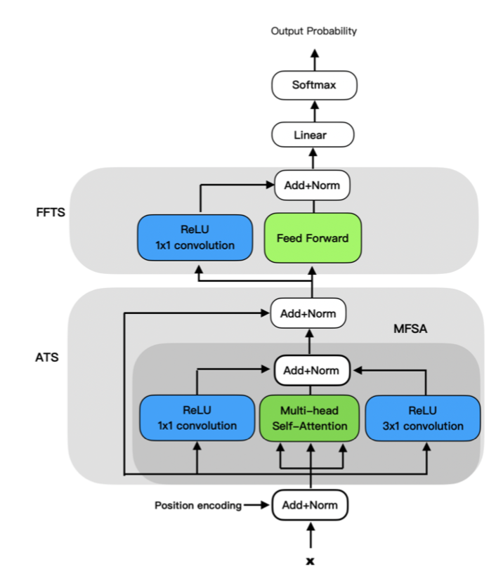

<h2 align="center">BAT</h2>
<h3 align="center">BORN FOR AUTO-TAGGING: FASTER AND BETTER WITH NEW OBJECTIVE FUNCTIONS</h3>

To extract keywords in e-commerce documents, we need to get high macrof1 and macrof2. Others loss can not achieve good enough metrics, so we create PBP and CECLA loss to achieve this purpose. In addition, we create BAT model to attain better performance than others SOTA model.

[paper link](https://arxiv.org/abs/2206.07264)

The data we used can not release, so we implement on CONLL2003 English dataset and get the great f1 on it.


## Table of Contents
- [Introduction](#introduction)
- [EnvironmentSetting](#Environment-setting)
- [Installation](#installation)
- [QuickStart](#quick-start)
- [Performance](#performance)
- [Reference](#reference)
- [Citation](#citation)

## Introduction
放論文模型跟loss function
放CONLL2003資料表現
<p align="center"></p>

## Environment Setting
- python: 3.7
- recommend to use pipenv to build the develop environment

## Installation
```
pip install -r requirements.txt
```
```
pip install -e .
```

## Quick Start 
**CONLL2003-English mission**

After checking requirements and finishing installation, you can follow this step:

(1) Get CONLL2003 dataset from [here](https://www.clips.uantwerpen.be/conll2003/ner/) and detail from [here](https://www.aclweb.org/anthology/W03-0419).
Then move train.txt, dev.txt, and test.txt to /BAT/data.

(2) Tune the configure file. (or you can use default)
```
cd /BAT/config
```
```
vim conll2003.yaml
```

(3) Train model.

**We connect xlm-roberta-large(freeze) model and bat model, and only train on bat model.**


Enter to python environment.
```shell
$ python
>>> import nltk
>>> nltk.download('punkt')
```

```
cd /BAT
```

```
CUDA_VISIBLE_DEVICES=0 python sample_conll.py --config-name conll2003.yaml
```
or (use tee to save training log)
```
CUDA_VISIBLE_DEVICES=0  python -u sample_conll.py --config-name conll2003.yaml 2>&1 | tee -a conll2003.log 
```
## Performance
Our sample code get f1:93 in CONLL2003-English NER mission.


## Reference
we follow https://github.com/wzhouad/NLL-IE preprocess for CONLL2003-English data.

## Citation

If this repository is helpful to you, please cite this paper.
```
@inproceedings{Liu-bat-2022,
  author    = {Chiung-Ju Liu, Huang-Ting Shieh},
  title     = {BAT: BORN FOR AUTO-TAGGING: FASTER AND BETTER WITH NEW OBJECTIVE FUNCTIONS},
  journal   = {arXiv preprint arXiv:2206.07264},
  year      = {2022}
}
```


